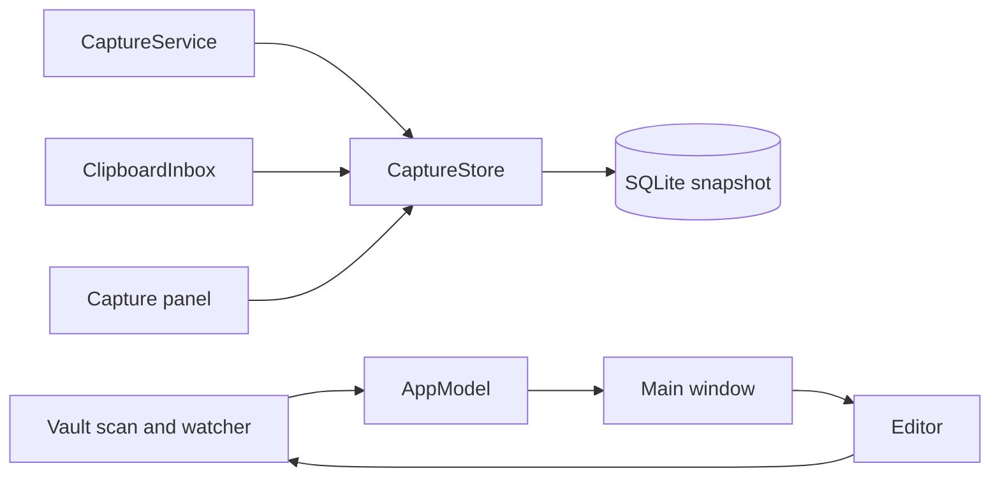

# Architecture

Piper is a Swift package. Model code lives in modules under `Sources/Modules`. The `Piper` application target sits above them and holds the windows and views. AppKit owns the windows and the panes. SwiftUI draws most pane content. The rules for new code are in [Coding guidelines](coding-guidelines.md).

## Modules

| Module | Responsibility | Depends on |
| --- | --- | --- |
| `CSQLite` | System SQLite, through `pkg-config` | nothing |
| `PiperCore` | `PiperError` and the frontmatter parser | Yams |
| `PiperTree` | `Node`, `TreeController`, and `PathTreeBuilder` | nothing |
| `CapturesDatabase` | One versioned blob in SQLite, with compare-and-swap | `CSQLite` |
| `Captures` | `Note`, `CaptureStore`, `ClipboardInbox`, `CaptureLinks`, and edit sessions | `PiperCore`, `CapturesDatabase` |
| `Vault` | One folder: scan, read, write, and watch | `PiperCore`, Yams |
| `Piper` | Windows, panes, views, and app state | All modules, Yams, and `MarkdownEngine` |

`PiperCore`, `PiperTree`, and `CapturesDatabase` have no dependency on another Piper module. `PiperCore` holds the frontmatter parser and Home search models.

Each module has a test target with the same name and a `Tests` suffix. `PiperTests` tests the application target.

## Windows

`AppDelegate` in `PiperApp.swift` creates each window when it first shows. It owns these windows:

| Window | Owner |
| --- | --- |
| Capture panel | `CapturePanelController` |
| Main window | `MainWindowController` |
| Settings | `SettingsWindowController` |
| Note editor windows | `AppDelegate`, one for each note |
| Capture toast | `AppDelegate` |

The capture panel and the main window are exclusive. `showPanel()` hides the main window, and `showLibrary()` hides the panel. Neither closes, so drafts and edit sessions stay. Closing every window leaves the app running in the menu bar.

The panel is a non-activating `NSPanel` on every Space. It is 430 by 932 points with 22-point corners, and it scales down on a small screen.

### Main Window

`MainWindowController` owns the toolbar and an `NSSplitViewController` with three split items:

| Pane | Controller | Content |
| --- | --- | --- |
| Sidebar | `SidebarViewController` | `SidebarOutline`, an `NSOutlineView` |
| List | `FileListViewController` | `FileListView` or `CaptureView` |
| Detail | `DetailViewController` | `HomeView`, `WikiEditor`, `FilePreview`, or `NoteDetail` |

Each controller subclasses `HostingPaneViewController`, which wraps an `NSHostingView`. A pane reports upward through a delegate protocol, and `MainWindowController` decides what the other panes show. `WikiEditor` is an exception. It calls `AppModel.openDocument` directly, so a link does not move the sidebar or the file list.

`SidebarSelection` decides the layout. Home collapses the file list because the search field needs the width. `MainWindowState` saves the selection, the open file, the open folders, and the pane widths.

The window title names the sidebar selection, as in Mail. The subtitle shows a count, and it updates through `withObservationTracking`. The toolbar has tracking separators that align with the split view dividers. Toggle Sidebar sits over the sidebar. New Capture sits over the list. Back and Forward, Preview and Source, Mark as Done, and the More menu sit over the detail pane. Each list has its own search field.

The sidebar has two groups. Library holds Home, Inbox with one child for each capture section other than Inbox, and Clipboard. Folders holds every root and the tree of the active root. `SidebarSelection.section` scrolls the Inbox list to a section, and `SidebarSelection.clipboard` shows the clipboard history.

Sidebar fonts and icons follow the macOS sidebar size preference: 11 and 16 points, 13 and 19 points, or 15 and 22 points. `TimelineCell` draws every file row through `TimelineRow`.

## Capture

`CaptureService` detects double Shift with `NSEvent` monitors. Control-Option-Space is a registered system hotkey, so the source app does not receive the keystroke.

The service records the source app and the active section before it reads Accessibility text. A serial queue reads the focused element with a 0.4-second timeout. If the selected text attribute is empty, the service uses the selected range. Secure fields and empty selections produce no note.

`CaptureStore` builds a candidate state and saves it before it replaces the current state. `Database` compares the stored blob with the last loaded blob on every save. A database error or a stale snapshot leaves the current notes as they are. See [Local storage](../concepts/storage.md).

`ClipboardInbox` polls the pasteboard and keeps the 50 latest texts from the last 7 days, with the copy time and the app in front. It stores them in the `clipboard` table through the `Database` of `CaptureStore`. `ClipboardRow` in `CaptureRows.swift` saves to Inbox with Keep, and pastes through `ClipboardPaster` on a double-click.

`CaptureView` draws the capture list for both windows. The list holds every section under a header, and a `SectionScroll` request scrolls it to one header. The panel keeps its own tab, and the main window passes the sidebar selection. The main-window controller routes note selection to the detail pane and limits shortcuts to the Inbox pane.

## Vault

`Vault` lists every file and folder under the root and applies no rule about structure. `VaultFile` holds the path, size, modification date, text, and parsed frontmatter. `VaultWatcher` wraps `FSEventStream` on a private queue and calls back on the main queue.

`AppModel` stores the folder list and the active root in preferences. `removeWikiFolder` moves the active root to another folder before it removes a root.

`AppModel` starts the watcher with the first scan and replaces it when the active root changes. A scan runs in the background. A change during a scan requests one more scan. A scan keeps unsaved edit sessions and updates clean editors and previews. See [Wiki files](../concepts/files.md).

`FileReadState` stores the last-read modification time of each file. `AppModel` computes unread state and folder counts, including subfolders. The first file selection waits until the detail pane shows before it marks the file read.

## Reading And Editing

`FilePresentation` decides how the detail pane shows a file. Markdown and HTML also have a read-only Source view through `PlainTextPreview`. `AppModel.showsFileSource` holds the choice. Markdown opens in the editor, other text in a read-only text view, and everything else in Quick Look.

`WikiEditor` embeds SwiftMarkdownEngine 0.12.0 through its AppKit bridge. The page is a centered column, at most 640 points wide, with 48-point side margins. `DetailHeader` shows the date and the save state above the page, and the title when the body has no heading.

Only a Markdown text file gets an edit session. `WikiSave.body` writes the original frontmatter bytes and the new body. It refuses to write if the file on disk no longer matches what the editor opened. Navigation, folder changes, window close, and quit resolve an unsaved session through Save, Discard, or Cancel.

`WikiWorkspace` owns the navigation history. `WikiLinks` resolves links and computes backlinks. `WikiMarkdown` parses blocks for the outline, heading anchors, and backlinks.

## Inbox Reader

`NoteDetail` shows a capture. `CaptureLinks` finds HTTP and HTTPS URLs with `NSDataDetector` and keeps the original text. If the capture is only a URL, the reader opens it at once.

`NoteWebReader` embeds `WKWebView` through `NSViewRepresentable`, which works on macOS 14. It keeps the requested URL apart from the current URL, so a view update does not restart navigation after a redirect. A new capture selection resets the reader.

The Capture button runs JavaScript in an isolated content world. One call returns the selected text or the page text, the title, and the URL. `CaptureStore` saves the result to Inbox.

`Info.plist` sets `NSAllowsArbitraryLoadsInWebContent`, so WebKit can load HTTP pages. Other network requests keep the default App Transport Security policy.

## Home Search

`HomeSearch` in `PiperCore` ranks `HomeSuggestion` rows. A leading `>` lists local `HomeAction` values. Other text lists file name matches, file text matches, and local actions, in that order.

The file-list search filters the selected folder. Inbox search filters the active capture section and temporary clipboard cards.

Home searches the whole vault. Its Search All Files action opens the `allFiles` sidebar state with a vault-wide list.

## Source Map

| Source | Responsibility |
| --- | --- |
| [PiperApp.swift](../../Sources/Piper/PiperApp.swift) | `AppDelegate`, menus, the menu bar item, editor windows, the toast, and quit |
| [AppModel.swift](../../Sources/Piper/AppModel.swift) | Scans, selection, and edit sessions |
| [AppDefaults.swift](../../Sources/Piper/AppDefaults.swift) | Preference keys, sizes, and metrics |
| [AppNotifications.swift](../../Sources/Piper/AppNotifications.swift) | Notification names |
| [PiperTheme.swift](../../Sources/Piper/PiperTheme.swift) | App colors, shapes, fonts, and shared controls |
| [FileReadState.swift](../../Sources/Piper/FileReadState.swift) | Read timestamps for each file |
| [CaptureService.swift](../../Sources/Piper/CaptureService.swift) | Global shortcuts and Accessibility selection |
| [CapturePanel/](../../Sources/Piper/CapturePanel) | `CapturePanelController` and `ClipboardPaster` |
| [CaptureView.swift](../../Sources/Piper/CaptureView.swift) | The capture list, tabs, selection bar, and composer |
| [CaptureRows.swift](../../Sources/Piper/CaptureRows.swift) | Capture rows, headers, and the section and note sheets |
| [CaptureEditor.swift](../../Sources/Piper/CaptureEditor.swift) | The composer text view |
| [MainWindow/MainWindowController.swift](../../Sources/Piper/MainWindow/MainWindowController.swift) | Split view, toolbar, and routing between panes |
| [MainWindow/MainWindowState.swift](../../Sources/Piper/MainWindow/MainWindowState.swift) | `SidebarSelection`, restored state, and pane delegate protocols |
| [MainWindow/PaneViewControllers.swift](../../Sources/Piper/MainWindow/PaneViewControllers.swift) | One hosting view controller for each pane |
| [MainWindow/RouteSheets.swift](../../Sources/Piper/MainWindow/RouteSheets.swift) | The error alert |
| [MainWindow/Home/](../../Sources/Piper/MainWindow/Home) | The Home page and its suggestion list |
| [MainWindow/Sidebar/](../../Sources/Piper/MainWindow/Sidebar) | Library rows, the folder tree, unread counts, and file warnings |
| [MainWindow/Browser/](../../Sources/Piper/MainWindow/Browser) | The file list |
| [MainWindow/Detail/](../../Sources/Piper/MainWindow/Detail) | Header, file previews, and the Inbox reader |
| [MainWindow/TimelineCell.swift](../../Sources/Piper/MainWindow/TimelineCell.swift) | File and capture rows |
| [WikiEditor.swift](../../Sources/Piper/WikiEditor.swift) | The Markdown editor page |
| [WikiInspector.swift](../../Sources/Piper/WikiInspector.swift) | Reading themes and fonts, and the unused inspector view |
| [WikiWorkspace.swift](../../Sources/Piper/WikiWorkspace.swift) | Navigation history, link resolution, and backlinks |
| [WikiMarkdown.swift](../../Sources/Piper/WikiMarkdown.swift) | Block parsing, heading anchors, and inline text |
| [Wiki.swift](../../Sources/Piper/Wiki.swift) | File metadata and the guarded body save |
| [SettingsWindow.swift](../../Sources/Piper/SettingsWindow.swift) | The Settings window and its panes |

`WikiReader.swift` and `MarkdownView.swift` are not used by any other file.
