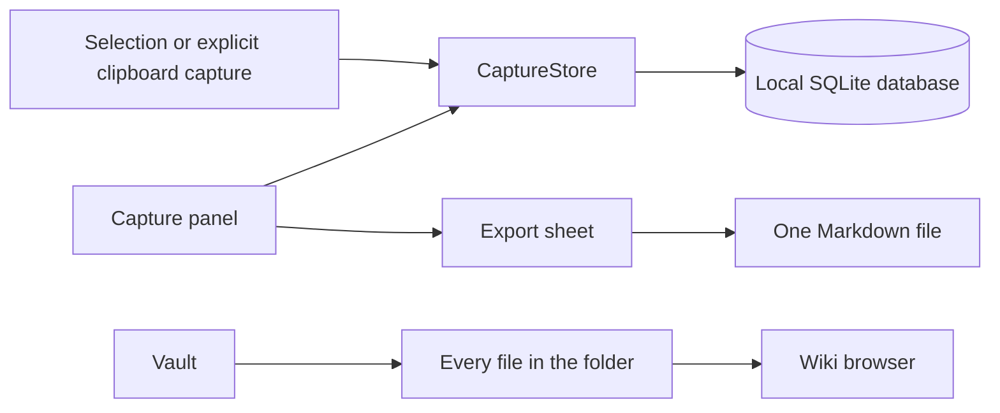

# Architecture

Piper is layered into modules under `Sources/Modules`, with a thin application target above them. AppKit owns the windows. SwiftUI draws the content of each pane. The rules that govern the code are in [Coding guidelines](coding-guidelines.md).

## Modules

Each module has one reason to exist. `PiperCore`, `PiperTree`, and `CapturesDatabase` add no dependency on another Piper module, which keeps them at the bottom of the graph.

| Module | Responsibility | Depends on |
| --- | --- | --- |
| `PiperCore` | `PiperError` and the frontmatter parser | Yams |
| `PiperTree` | `Node`, `TreeController`, and the path tree builder | nothing |
| `CapturesDatabase` | One versioned blob in SQLite, with compare-and-swap | CSQLite |
| `Captures` | `Note`, `CaptureStore`, `ClipboardInbox`, edit sessions | `PiperCore`, `CapturesDatabase` |
| `Vault` | One folder: scan, read, write, and watch | `PiperCore` |
| `PiperCommands` | Commands, skills, the search parser, and the agent | `PiperCore` |
| `Piper` | Windows, panes, and the views | all of them |

`PiperCore` holds the frontmatter parser because `Vault` and `PiperCommands` both read a YAML block, and neither has a reason to depend on the other.

## Window Ownership

`AppDelegate` creates two window controllers. Each one owns its window, its frame autosave name, and its toolbar.

`CapturePanelController` owns the floating panel. `MainWindowController` owns the Wiki window, which holds a split view of four panes: the folder tree, the file list, the file itself, and the inspector.

Each pane is an `NSViewController` whose view is an `NSHostingView`. A pane never calls another pane. It reports upward through a delegate protocol, and `MainWindowController` decides what happens next.

The window opens on the home page. A search result or a sidebar click swaps the content view controller for the split view. The Home toolbar button swaps it back, and the panes keep their state.

Note editor windows save changes explicitly. Closing a changed editor prompts to save or discard. Closing the main windows leaves the menu bar application running.

## Capture And Persistence

`CaptureService` detects double-Shift through NSEvent monitors. Control-Option-Space uses a registered system hotkey so the source editor does not receive the keystroke.

The service records the source application and active section before reading Accessibility text. Shortcut changes update registration immediately.

A serial queue reads the focused element with a bounded timeout. Selected-range lookup provides a fallback. Secure text fields and empty selections produce no note.

`CaptureStore` saves a candidate state before replacing the current state. Database errors and stale snapshot conflicts leave the current notes intact. `Database` stores an opaque blob and compares it against the stored blob on every save, so a second Piper instance cannot overwrite the first.

`ClipboardInbox` observes pasteboard changes and keeps a temporary text buffer. Clicking a ghost card saves through `CaptureStore`.

## The Vault

`Vault` lists every regular file in the folder. It applies no rule about names, folders, or metadata. A file needs no frontmatter, and a file that has none produces no problem to report.

Frontmatter, where a file has it, becomes optional metadata that the inspector shows. It never changes how the browser sorts or groups files.

The scan refuses to follow symbolic links, refuses a path that leaves the folder, and skips `node_modules`, `venv`, `__pycache__`, and hidden files. A per-file read error joins a list of problems, and the scan continues.

`VaultWatcher` wraps `FSEventStream`. The stream runs on a private queue and calls back on the main queue.

`Frontmatter` splits the original text, never a normalized copy, so a file written with CRLF keeps its CRLF bytes through a save.

## Commands And Skills

Claude Code reads two kinds of extension, and Piper lists both. A command is `.claude/commands/<name>.md`. A skill is `.claude/skills/<name>/SKILL.md`, and its name comes from the `name` key in the frontmatter.

Two scopes hold them. `claude` reads the folder's `.claude` and the home folder's `.claude`, so Piper reads both and tags a personal row. A name in both scopes resolves to the folder one.

A skill body reaches thousands of lines, so the index reads a bounded prefix of each file and parses the block out of that. A skill `description` runs to several sentences, so a row shows the first sentence.

Either scope can be a symbolic link to a dotfiles folder. The index resolves that link, because a configuration folder is not vault content.

## Reading And Editing

`AppModel` coordinates scans, selection, and export. `WikiWorkspace` owns a single navigation history. `WikiLinks` resolves local links and computes backlinks. `WikiMarkdown` supplies reader blocks, heading anchors, and inline text.

`WikiEditor` embeds SwiftMarkdownEngine 0.12.0 through its AppKit bridge. Reading and editing share one text view and scroll view.

Each open file has an editable session. Saving preserves that session. Navigation, window closure, and quit resolve unsaved changes through Save, Discard, or Cancel. A save refuses when the file on disk no longer matches what the editor opened.

The reader does not use a web view or fetch remote content.

## Export

Export writes the captures to one Markdown file that the reader names in a save panel. It writes that file and nothing else. It builds no index, and it appends to no log.

## Source Map

| Source | Responsibility |
| --- | --- |
| [PiperApp.swift](../../Sources/Piper/PiperApp.swift) | Menus and application lifecycle |
| [AppDefaults.swift](../../Sources/Piper/AppDefaults.swift) | Every preference key, size, and metric |
| [AppNotifications.swift](../../Sources/Piper/AppNotifications.swift) | Every notification name |
| [MainWindow/MainWindowController.swift](../../Sources/Piper/MainWindow/MainWindowController.swift) | Split view, toolbar, and the routing between panes |
| [MainWindow/PaneViewControllers.swift](../../Sources/Piper/MainWindow/PaneViewControllers.swift) | One hosting view controller per pane |
| [MainWindow/Home/](../../Sources/Piper/MainWindow/Home) | The search page and its suggestion list |
| [MainWindow/Sidebar/](../../Sources/Piper/MainWindow/Sidebar) | The folder tree |
| [MainWindow/Browser/](../../Sources/Piper/MainWindow/Browser) | The file list |
| [MainWindow/TimelineCell.swift](../../Sources/Piper/MainWindow/TimelineCell.swift) | The one file row that every list uses |
| [MainWindow/RouteSheets.swift](../../Sources/Piper/MainWindow/RouteSheets.swift) | Settings, commands, and the error alert |
| [CapturePanel/](../../Sources/Piper/CapturePanel) | The floating panel and its window controller |
| [CaptureService.swift](../../Sources/Piper/CaptureService.swift) | Global gesture and Accessibility selection |
| [AppModel.swift](../../Sources/Piper/AppModel.swift) | Navigation, edit sessions, and coordination |
| [Wiki.swift](../../Sources/Piper/Wiki.swift) | Export text, file name, and the guarded body write |
| [PanelView.swift](../../Sources/Piper/PanelView.swift) | Capture panel, note actions, and editor |
| [WikiEditor.swift](../../Sources/Piper/WikiEditor.swift) | Shared reading and editing page |
| [WikiInspector.swift](../../Sources/Piper/WikiInspector.swift) | Save controls, file details, outline, and backlinks |
| [WikiWorkspace.swift](../../Sources/Piper/WikiWorkspace.swift) | Navigation history and link resolution |
| [LibraryView.swift](../../Sources/Piper/LibraryView.swift) | Export sheet and settings |
