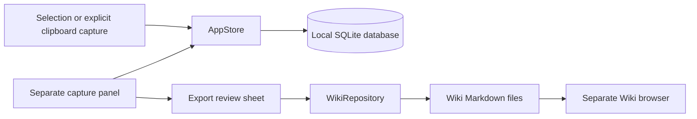

# Architecture

AppKit owns the windows and system integrations. SwiftUI provides their content. AppStore owns capture state, and WikiRepository reads and writes Wiki files.

## Window Ownership

`AppDelegate` creates a floating `NSPanel` and a separate Wiki `NSWindow`. Each window saves its frame independently.

The export review sheet belongs to the capture panel. Read in Wiki explicitly opens the browser after export. Settings appears inside the browser.

Note editor windows save changes explicitly. Closing a changed editor prompts to save or discard. Closing the main windows leaves the menu bar application running.

## Capture And Persistence

CaptureService detects double-Shift through NSEvent monitors. Control-Option-C uses a registered system hotkey so the source editor does not receive the keystroke.

The service records the source application and active section before reading Accessibility text. Shortcut changes update registration immediately.

A serial queue reads the focused element with a bounded timeout. Selected-range lookup provides a fallback. Secure text fields and empty selections produce no note.

Capture monitors start after Accessibility approval and stop when permission is revoked. Launch opens the capture panel. A second launch reopens the existing instance.

AppStore saves a candidate state before replacing the current state. Database errors and stale snapshot conflicts leave the current notes intact.

ClipboardInbox observes pasteboard changes and keeps a temporary text buffer. Clicking a ghost card saves through AppStore. Clipboard previews use no Accessibility permission.

## Wiki Access

AppModel coordinates scans, selection, and export. Visible Wiki documents refresh every four seconds while the current note has no unsaved changes. WikiRepository parses YAML through Yams.

WikiWorkspace owns a single navigation history. WikiLinks resolves local links and computes backlinks. WikiMarkdown supplies reader blocks, heading anchors, and inline text.

The browser uses native SwiftUI controls. WikiEditor embeds SwiftMarkdownEngine 0.12.0 through its AppKit bridge. Reading and editing share one text view and scroll view.

Each open note has an editable session. Saving preserves that session. Navigation and window closure resolve unsaved changes through Save, Discard, or Cancel. Outline navigation uses character ranges in the displayed text. Focus mode hides navigation panes.

WikiInspector holds manual save controls, document actions, reading preferences, and note navigation in the right column. A bounded SwiftUI frame lets the native text view reflow when either sidebar changes.

The reader does not use a web view or fetch remote content.

Export creates a draft, regenerates indexes, and appends a log entry. Existing concept files remain unchanged.

## Source Map

| Source | Responsibility |
| --- | --- |
| [PiperApp.swift](../../Sources/Piper/PiperApp.swift) | Windows, menus, and application lifecycle |
| [CaptureService.swift](../../Sources/Piper/CaptureService.swift) | Global gesture and Accessibility selection |
| [ClipboardInbox.swift](../../Sources/Piper/ClipboardInbox.swift) | Temporary clipboard previews and explicit saving |
| [AppStore.swift](../../Sources/Piper/AppStore.swift) | Capture state, edit sessions, and note operations |
| [Database.swift](../../Sources/Piper/Database.swift) | SQLite snapshot persistence |
| [PanelView.swift](../../Sources/Piper/PanelView.swift) | Capture panel, note actions, and editor |
| [CaptureEditor.swift](../../Sources/Piper/CaptureEditor.swift) | Native composer text, focus, and scrollbar |
| [AppModel.swift](../../Sources/Piper/AppModel.swift) | Wiki navigation and application coordination |
| [Wiki.swift](../../Sources/Piper/Wiki.swift) | Files, metadata, and export |
| [WikiLibraryView.swift](../../Sources/Piper/WikiLibraryView.swift) | File tree, search, header, and reading controls |
| [WikiWorkspace.swift](../../Sources/Piper/WikiWorkspace.swift) | Navigation history, file tree, and link resolution |
| [WikiEditor.swift](../../Sources/Piper/WikiEditor.swift) | Shared reading and editing page, typography, and link conversion |
| [WikiInspector.swift](../../Sources/Piper/WikiInspector.swift) | Manual save, document actions, reading preferences, outline, backlinks, and note details |
| [WikiReader.swift](../../Sources/Piper/WikiReader.swift) | Markdown block rendering |
| [WikiMarkdown.swift](../../Sources/Piper/WikiMarkdown.swift) | Reader blocks and inline Markdown |
| [LibraryView.swift](../../Sources/Piper/LibraryView.swift) | Export review and settings |
| [MarkdownView.swift](../../Sources/Piper/MarkdownView.swift) | Capture Markdown rendering |
